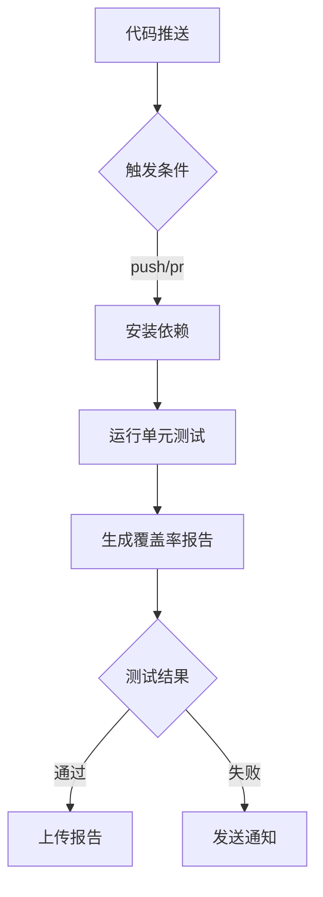

# 测试框架使用指南

## 本地测试流程

### 前置要求
```bash
# 安装依赖
sudo apt-get install -y bats lcov
```

### 运行全部测试
```bash
./test/run.sh
```

### 查看覆盖率报告
```bash
open coverage/index.html  # macOS
xdg-open coverage/index.html  # Linux
```

### 常用测试模式
```bash
# 运行单个测试文件
bats test/kp.bats

# 运行单个测试用例
bats test/kp.bats -f "子命令参数透传验证"

# 生成JUnit格式报告
bats -r test/ --formatter junit > test-results.xml
```

## 核心测试用例说明

### 自动补全测试矩阵
| 测试场景                 | 输入命令            | 预期补全结果       |
|--------------------------|---------------------|--------------------|
| 主命令补全               | `kp [Tab]`          | 显示 p/f/l/i       |
| 子命令参数补全           | `kp p -o [Tab]`     | json/yaml/wide     |
| 命名空间补全             | `kp p -n [Tab]`     | 当前集群所有ns     |
| Pod名称补全              | `kp l [Tab]`        | 当前ns的Pod列表    |
| 跨命名空间补全           | `kp f -n dev [Tab]` | dev命名空间的服务  |
| 容器名称补全             | `kp l pod -c [Tab]` | 指定Pod的容器列表  |

### 关键路径测试项
```bash
# 参数透传验证
test/kp.bats -f "子命令参数透传验证"

# 错误处理测试
test/error_handling.bats -f "无效命名空间处理"

# 性能基准测试
test/benchmark.bats -f "日志搜索性能基准"
```

## CI/CD 集成流程

### GitHub Actions 工作流程


### 典型执行步骤
1. 安装系统依赖：`bats`, `jq`, `curl`
2. 克隆测试依赖库：`bats-assert`, `bats-support`
3. 并行执行测试套件：
   - 单元测试
   - 集成测试
   - E2E测试
4. 生成可视化报告并上传至Artifacts

### 问题排查指南
```bash
# 查看详细调试输出
BATS_VERBOSE=1 bats test/kp.bats

# 保留测试临时文件
BATS_KEEP_TEMP=1 bats test/integration.bats

# 查看kubectl模拟调用
cat $BATS_TMPDIR/kubectl.log
``` 